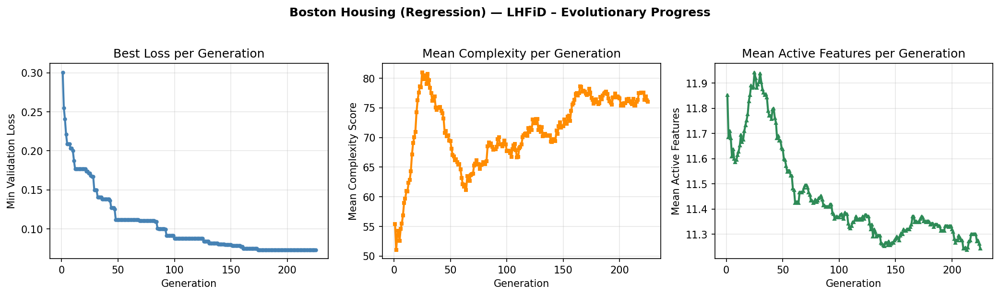
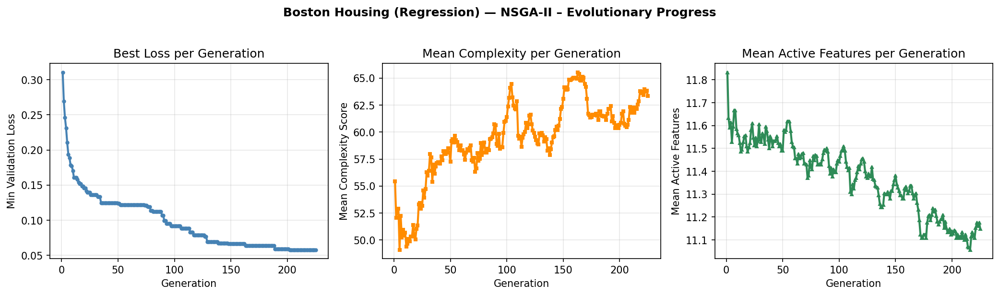

# Interpretable Neural Networks via Multi-Objective Evolution

Evolutionary framework for discovering **interpretable neural networks** by simultaneously optimizing predictive performance, structural complexity, and feature sparsity. Two multi-objective evolutionary algorithms — **NSGA-II** and **LHFiD** — are implemented and compared.

The aim is to produce models suited for **scientific knowledge discovery, security verification, and debugging**, where understanding the input–output relationship matters as much as raw accuracy.

---

## Motivation

A model that predicts well is not automatically a model a human can *understand*. To be useful for knowledge discovery, a model must be:

- **Accurate** — low error / high accuracy on held-out data.
- **Structurally simple** — few connections and few active neurons, so the computation can be traced.
- **Feature-sparse** — relies on few input features, so the discovered relationship is concentrated and human-readable.

These three goals conflict. We treat them as a **three-objective optimization problem** and search for the Pareto-optimal trade-off surface using evolutionary algorithms.

---

## Method

### Encoding
A candidate network is encoded as **two binary connectivity matrices**:
- `mask1` — input → hidden connections, shape `(n_input, n_hidden_max)`
- `mask2` — hidden → output connections, shape `(n_hidden_max, n_output)`

A masked weight is gated (zero contribution, zero gradient), so the mask alone defines the *effective* architecture; the weight matrices are learned for whatever topology the masks describe.

### Three Objectives (all minimised)
| # | Objective | Definition |
|---|-----------|-----------|
| 0 | Performance | Validation loss (MSE for regression, BCE for classification) |
| 1 | Complexity | Active connections + active neurons |
| 2 | Feature Sparsity | Number of input features with at least one outgoing connection |

### Evolutionary Loop
```
Initialise → [Evaluate → Mutate → Train → Select] × n_generations
```
Mutation operators:
1. Stochastic bit-flip across both masks
2. Add-neuron (grow capacity)
3. Remove-neuron (prune capacity)

Offspring inherit parent weights (**Lamarckian warm-start**) for surviving connections, sharply reducing the epochs needed per generation.

### Selection Strategies
- **NSGA-II** — non-dominated sorting + crowding distance.
- **LHFiD** — Localized High-Fidelity-Dominance (Saxena et al., 2023): Das-Dennis reference directions, adaptive nadir-based normalization, perpendicular-distance clustering, directional Chebyshev tie-breaking, and a stabilisation tracker for automatic early termination.

---

## Repository Layout

```
explainablenn/
├── main.py                  # Entry point — runs both algorithms on Boston Housing
├── data_loader.py           # Boston Housing & Breast Cancer loaders with selective z-scoring
├── network.py               # InterpretableNN — masked feed-forward network
├── evolution.py             # Population, mutation, training, NSGA-II/LHFiD loop
├── lhfid.py                 # LHFiD selection core (reference dirs, normalization, HF dominance)
├── render_pareto_3d.py      # Standalone re-render of the published 3D Pareto figure
├── archive/                 # Raw CSV datasets (HousingData.csv, data.csv)
└── results/
    └── boston_housing/
        └── run_v<N>/        # Each run is auto-versioned; only run_v8 graphs are tracked in this repo
            ├── lhfid/
            │   └── history.png
            ├── nsga2/
            │   └── history.png
            ├── comparison_2d.png
            └── comparison_3d.png
```

> **Note:** Trained Pareto models (`pareto_models/`) are **not** committed to the repository — re-run `main.py` to regenerate them locally. Only the published graphs for `run_v8` are tracked.

---

## Quick Start

```bash
# 1. Set up environment
python -m venv venv
source venv/bin/activate
pip install numpy pandas torch matplotlib

# 2. Run the experiment (Boston Housing, both algorithms)
python main.py
```

Each invocation creates `results/boston_housing/run_v<next>/` so previous runs are never overwritten. Trained model weights, masks, and metadata are written under each `pareto_models/` folder locally.

To re-render the published 3D Pareto figure from the embedded data:
```bash
python render_pareto_3d.py
```

---

## Default Configuration

| Hyperparameter | Value |
|---|---|
| Population size | 210 (matches 210 Das-Dennis vectors at H=19) |
| Max generations | 500 (LHFiD may terminate earlier via stabilisation) |
| Max hidden width | 20 |
| Initial training epochs | 200 |
| Offspring training epochs | 120 |
| Learning rate | 1e-3 |
| Weight decay | 1e-4 |
| Bit-flip probability | 0.05 |
| Add/remove-neuron probability | 0.20 / 0.20 |
| Reference partitions (LHFiD) | 19 |
| Seed | 42 |

---

## Results — Boston Housing (`run_v8`)

> Graphs for `run_v8` are the only artefacts committed in this repo. Earlier runs (`run_v1`–`run_v7`) exist locally but are not tracked.

### LHFiD — Evolutionary Progress
LHFiD ran for **225 generations** (auto-terminated by the stabilisation tracker).
- Min validation loss: **~0.30 → ~0.08**
- Mean complexity spiked to ~80 around gen 25 (exploration), then consolidated at ~75–77
- Mean active features declined steadily from ~11.9 → ~11.3
- Smooth, monotonic loss descent — diversity preservation supports stable convergence



### NSGA-II — Evolutionary Progress
NSGA-II ran for the **same number of generations** as LHFiD for a fair comparison.
- Min validation loss: **~0.31 → ~0.06**
- Mean complexity oscillated upward and settled near 62–65 without clear plateau (ongoing exploration)
- Mean active features declined from ~11.8 → ~11.1
- Rapid early improvement, slower late-stage refinement



### 3D Pareto Front — LHFiD vs NSGA-II
Both algorithms populate similar regions of the (loss, complexity, features) space.
- **NSGA-II** (blue) reaches slightly lower minimum loss (~0.05–0.06)
- **LHFiD** (red) clusters more densely in the mid-to-low loss band (~0.08–0.20)
- Neither front strictly dominates the other; sparsity and complexity trade-offs are comparable


---

## Conclusion

Both NSGA-II and LHFiD successfully evolved interpretable neural architectures on the Boston Housing dataset, producing competitive Pareto fronts across validation loss, structural complexity, and feature sparsity. NSGA-II held a marginal edge in minimum achievable loss (~0.06 vs ~0.08) through more aggressive architectural exploration, while LHFiD exhibited smoother, more stable convergence courtesy of its diversity-preserving reference-vector mechanism. The results confirm that multi-objective evolutionary search effectively exposes the accuracy–interpretability trade-off and yields sparse, low-complexity networks without sacrificing predictive performance — directly supporting the original goal of building models suited for scientific discovery, human verification, and debugging.

---

## Output Format (Generated Locally)

Each Pareto-optimal model is persisted to disk on a local run as:
```
model_XX/
├── mask1.npy        # int8 input→hidden connection matrix
├── mask2.npy        # int8 hidden→output connection matrix
├── weights.pt       # PyTorch state_dict (W1, b1, W2, b2)
└── metadata.json    # val_loss, complexity, active_features, feature names, pareto_rank
```
A `pareto_summary.json` aggregates all models in one front for quick inspection.

---

## References

- Deb K., Pratap A., Agarwal S., Meyarivan T. *A Fast and Elitist Multiobjective Genetic Algorithm: NSGA-II.* IEEE TEC, 6(2), 2002.
- Saxena D.K., Mittal S., Kapoor S., Deb K. *Localized High-Fidelity-Dominance-Based Many-Objective Evolutionary Algorithm.* IEEE TEC, 27(4), 923–937, 2023. DOI: 10.1109/TEVC.2022.3188064
